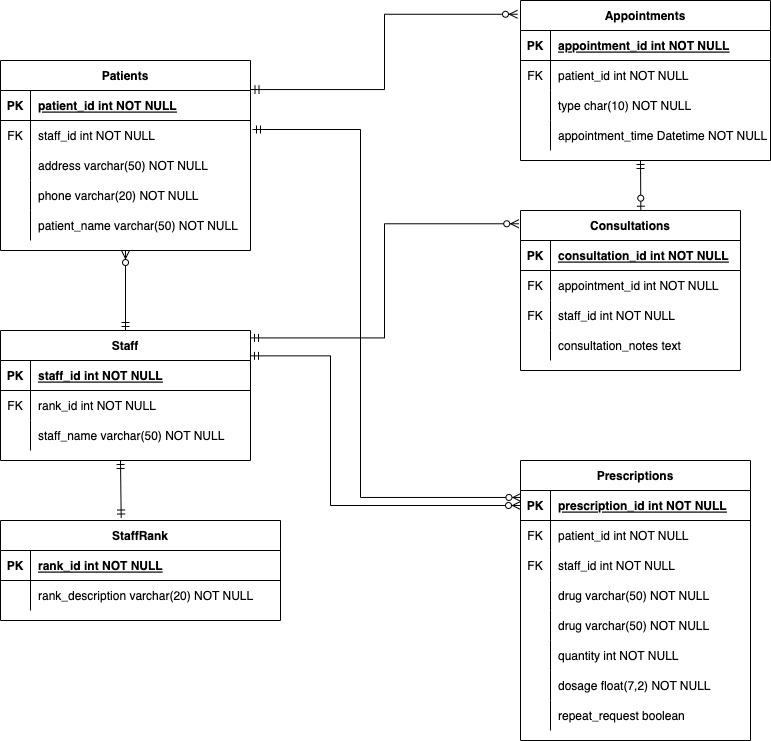

# System Implementation Assignment

This assignment is a simple implementation of a clinical system. It provides a landing page for both patients and staff (doctor, nurse and receptionist) to login. After that, they will be directed to different portal pages to perform specific functions.

### How to start

In Codio, set the port to 5000 in the configuration. Type in **python3 systemImplementation.py** in the terminal to start the flask server and go to the box url to start using the application.

### Landing Page

This page serves as a simple login page for users. The application will use the input staff/ patient ID to check against the Patients and Staff table in the database. If there is a match, the user will be directed to the specific portal page.

The retrieved information of the staff/ patient will be saved as global variables and used to initialize respective class objects.

### Doctor Page

The page contains links to the 3 functions doctor can perform, namely _consultation_, _issue prescription_, and _check appointment schedule_.

### Nurse Page

This is similar to the doctor page, except it only has links to _consultation_ and _check appointment schedule_.

### Consultation page

This serves to record the consultation notes in the Consultations table.

### Issue Prescription

Similar as the consultation page, it will get the staff ID from the class object initiated and together with the form inputs to save into the Prescriptions table. The **request_repeat** field in the table is defaulted to be false when saving into the database. This makes sense as there should be no repeat request from patients when the prescription is newly issued by doctors.

### Receptionist Page

This page provides functions of confirming appointment and cancelling appointment. It also contains a link to the appointment schedule page.

The _confirm appointment_ will update the status of the appointment to "confirmed" in the Appointments table. In business practice, receptionists will use this function to confirm the appointment requests from patients.
The _cancel appointment_ function acts similarly by updating the status of the appointment to "cancelled". The reason why it does not remove the record is based on the consideration of possible checking of cancelled records and statistical analysis for business needs.

### Appointment Schedule

This page provides a view of all records in the Appointments table in the order of status, time, and then name to make viewing easier.

It can also add "confirmed" appointments directly and cancel appointments.

Another function is the _find next available_ which will find the soonest possible time an appointment can be made.It will get the current time and check against the database if the nearest time-slot is already full. If yes, it will continue to search within the office hour of the clinic until an available slot is found.

### Patient Page

Patient page provides _request prescription repeat_ functionality which will mark the _request_repeat_ field in the Prescriptions table to true. The _request appointment_ will add a record with status "requested" in the Appointments table. Receptionists will then confirm the appointment.

## Development Process

As database plays a vital role in this implementation, an ER diagram was first drawn to illustrate the relationship among the tables and perform normalization if needed. Afterwards, the tables were created accordingly in the mysql database.

After all the tables were created, the classes and their methods were first developed. The frontend part was developed at last.

Regarding testing, the sql queries were first tested in the terminal before incorporating them into the class methods. After confirming all the class methods were working properly, testings simulating the usage flow of a user on the frontend were carried out. It is to confirm the application is working properly from a user's perspective.

As this is only a basic implementation, there are still many areas that need to be improved. In particular, security on both log in function and the database should be improved in real practice as it contains sensitive personal information.
